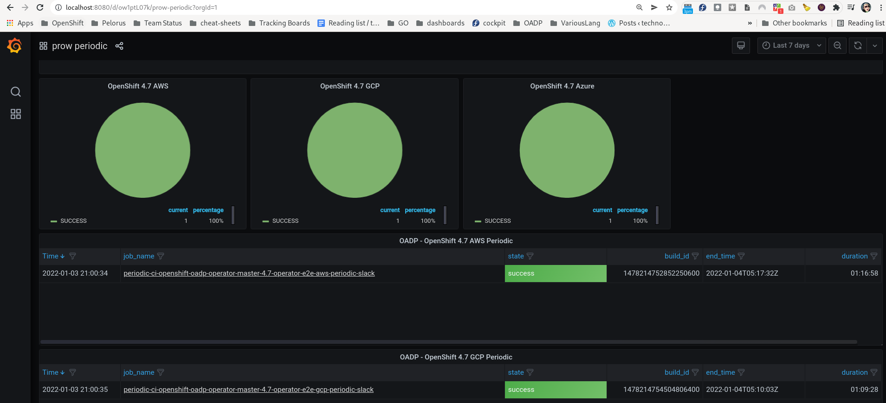

# go_scrape_prow
###### tags: `Documentation`

## Quick look at things
```
cd go_scrape_prow/src
go build prow.go
./prow --help
./prow -print_for_human -url_to_scrape https://prow.ci.openshift.org/?job=*oadp*
```

#### Expected Output
    * one row of data
```
{id:1478311211224272896
state:success
state_int:0
log_url:https://prow.ci.openshift.org/view/gs/origin-ci-test/pr-logs/pull/openshift_oadp-operator/458/pull-ci-openshift-oadp-operator-master-4.7-images/1478311211224272896
log_yaml:https://prow.ci.openshift.org/prowjob?prowjob=6a581613-6d48-11ec-a4aa-0a580a810d32
log_artifacts:/pr-history?org=openshift&repo=oadp-operator&pr=458
start_time:2022-01-04T10:23:53Z
end_time:2022-01-04T10:29:54Z
name:pull-ci-openshift-oadp-operator-master-4.7-images
pull_request:todo
}
```

## Screenshot of UI
* There is quite a bit of customization required here



## Components
### GOLANG - prow.go
    * Usage
    ```
    Usage of ./prow:
  -print_for_human
    	print for a human, not influxdb
  -url_to_scrape string
    	prow url to scrape, e.g.  (default "https://prow.ci.openshift.org/?job=*oadp*")
    ```

    * Uses [geziyor](https://github.com/geziyor/geziyor) to scrape the first page from prow.
    * Uses net/http for the remaining pulls of data and logs

    * Dumps data collected from from prow into a data map in either human readable output or output specifically for [influxdb](https://docs.influxdata.com/influxdb/v2.1/reference/syntax/line-protocol/)


### Influxdb
    * A timeseries database https://docs.influxdata.com/
### Telegraf
    * A simple tool for collecting metrics from various systems.  For the sake of this tool it acts as a cron like agent and writes directly to influxdb
    * https://docs.influxdata.com/telegraf/v1.21/
    * This can and probably should be replaced with prometheus https://prometheus.io/

### Grafana
    * An opensource tool for visualizing data https://grafana.com/


## Tool directory layout
```
├── development_script.sh
├── docker-compose.yml
├── expected_output.txt
├── grafana
│   ├── create-api-key.py
│   ├── Dockerfile
│   ├── entrypoint.sh
│   ├── env
│   ├── export-grafana.py
│   ├── get_alerts.py
│   ├── get_alerts.pyc
│   ├── Google Sheets.datasource.json
│   ├── grafana-alert-notification-server.py
│   ├── import-grafana.py
│   ├── mariadb.datasource.json
│   ├── oadp-pull-test.dashboard.json
│   ├── prow.dashboard.json
│   ├── prow-periodic.dashboard.json
│   ├── requirements.txt
│   └── telegraf.datasource.json
├── README.md
├── src -> telegraf/src/
└── telegraf
    ├── Dockerfile
    ├── env
    ├── influxdb.repo
    ├── src
    │   ├── go.mod
    │   ├── go.sum
    │   ├── prow
    │   └── prow.go
    ├── telegraf.conf
    └── telegraf.d
        └── prow_jobs.conf
```

## Notable files:
* development_script

Tool for creating docker volumes and starting the compose.  It can also cleanup docker files and volumes when you are finished.

```
./development_script.sh --help
usage: simple script to setup the cockpit
+ echo ' -s, --start, fire it up '
 -s, --start, fire it up
+ echo ' -c, --clean, to stop and clean up containers'
 -c, --clean, to stop and clean up containers
+ echo ' -h, --help, usage'
 -h, --help, usage

```

* docker-compose.yml

The docker-compose defines and sets the variables for the various containers and tools required for this all to work together.

The docker-compose should be converted into an openshift deployment config.  Ultimately this should run on OpenShift.

Usage: invoke compose or get logs
e.g.
```
 docker-compose up -d --build
 docker-compose logs -f telegraf
```

* grafana <dir>
    * holds the src .json files for each grafana page
        * e.g. prow.dashboard.json
    * tools to create an api key and export changes to the ui
        * create-api-key.py
        * export-grafana.py ( exports local UI changes to json)

* telegraf <dir>
    * The telegraf container is where prow.go executes
    * Dockerfile
        * Review the Dockerfile here telegraf/Dockerfile
            * You will see how telegraf and prow.go are installed
    * env
        * The environment variables required for telegraf to hook into influxdb
    * telegraf.d/*
        * essentially cron like files that define commands, intervals and timeouts
